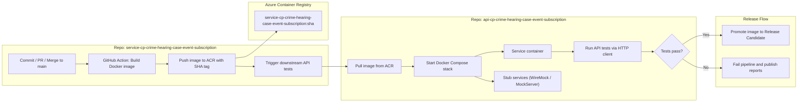

```mermaid
flowchart LR

subgraph SVC["Repo: service-cp-crime-hearing-case-event-subscription"]
  A["Commit / PR / Merge to main"]
  B["GitHub Action: Build Docker image"]
  C["Push image to ACR with SHA tag"]
  D["Trigger downstream API tests"]
  A --> B --> C --> D
end

subgraph ACR["Azure Container Registry"]
  C2["service-cp-crime-hearing-case-event-subscription:sha"]
end

C --> C2

subgraph TESTS["Repo: api-cp-crime-hearing-case-event-subscription"]
  E["Pull image from ACR"]
  F["Start Docker Compose stack"]
  F1["Service container"]
  F2["Stub services (WireMock / MockServer)"]
  G["Run API tests via HTTP client"]
  H{"Tests pass?"}

  E --> F
  F --> F1
  F --> F2
  F1 --> G
  G --> H
end

D --> E

subgraph RELEASE["Release Flow"]
  I["Promote image to Release Candidate"]
  J["Fail pipeline and publish reports"]
end

H -- Yes --> I
H -- No --> J
```