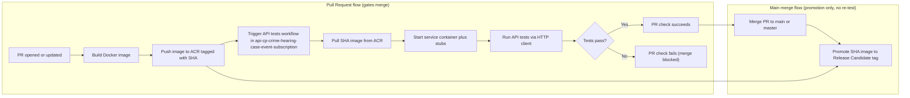

# Build pipeline with API test execution

```mermaid
flowchart LR

subgraph PR["Pull Request flow (gates merge)"]
  A["PR opened or updated"]
  B["Build Docker image"]
  C["Push image to ACR tagged with SHA"]
  D["Trigger API tests workflow in api-cp-crime-hearing-case-event-subscription"]
  E["Pull SHA image from ACR"]
  F["Start service container plus stubs"]
  G["Run API tests via HTTP client"]
  H{"Tests pass?"}
  I["PR check succeeds"]
  J["PR check fails (merge blocked)"]

  A --> B --> C --> D --> E --> F --> G --> H
  H -- Yes --> I
  H -- No --> J
end

subgraph MAIN["Main merge flow (promotion only, no re-test)"]
  K["Merge PR to main or master"]
  L["Promote SHA image to Release Candidate tag"]
  K --> L
end

C --> L
I --> K
```
